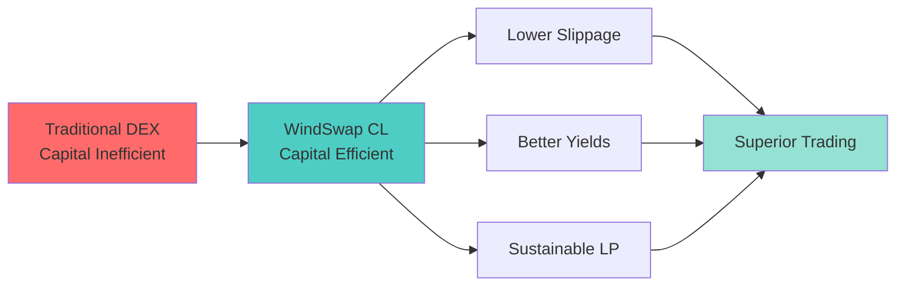
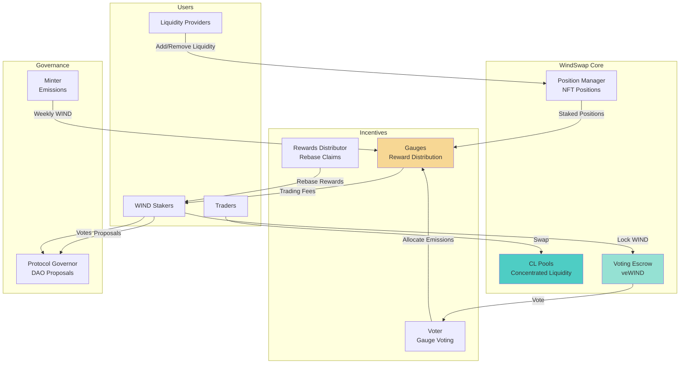
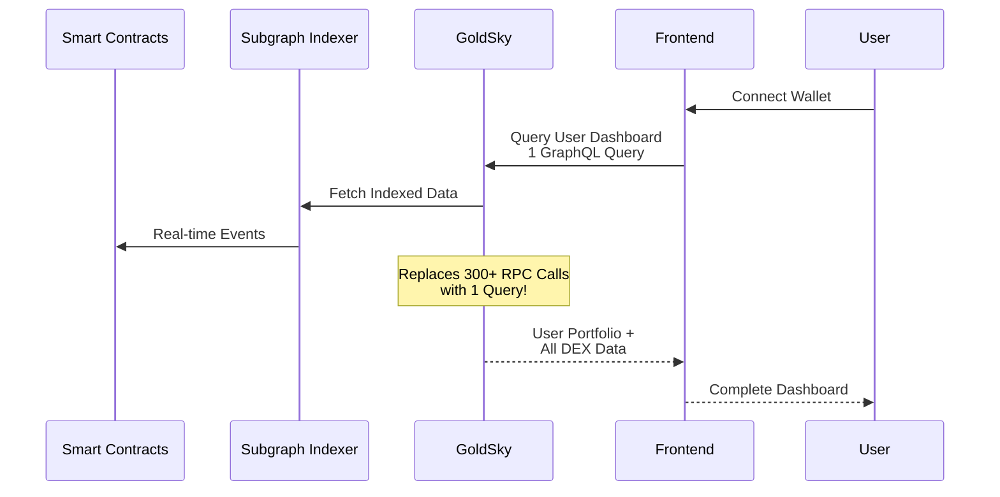
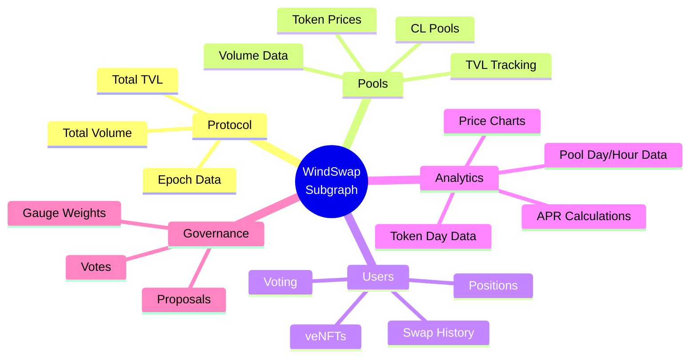
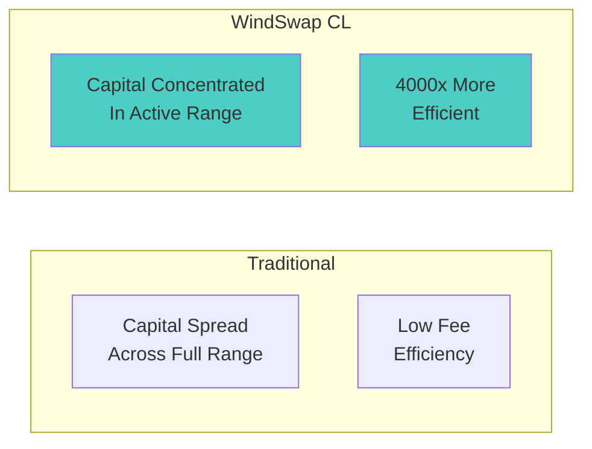
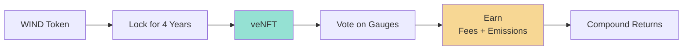
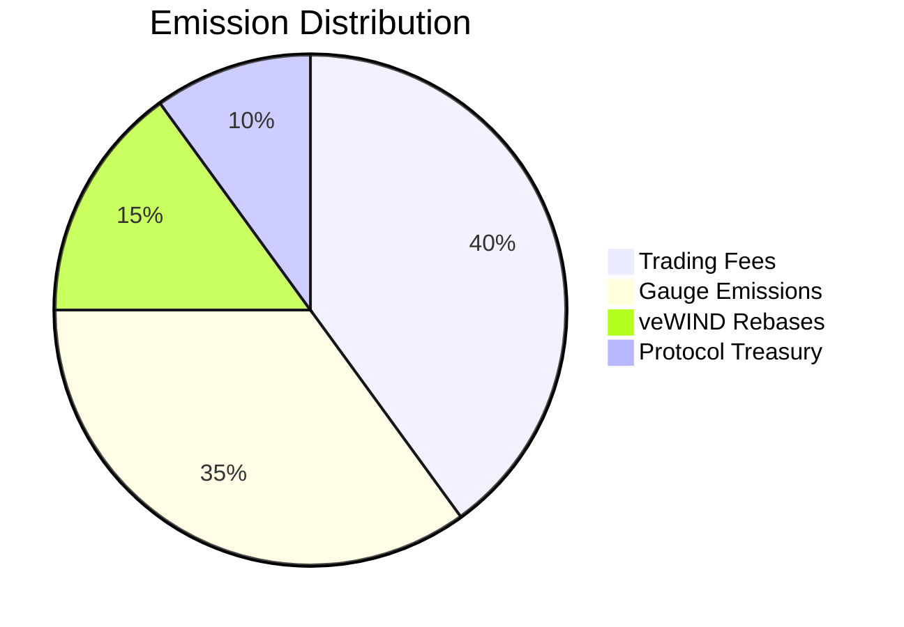

# WindSwap DEX

**Next-Generation Concentrated Liquidity DEX on Sei Network**


---

## 🎯 Our Mission

### Revolutionize DeFi Trading Through Concentrated Liquidity



**WindSwap is building the most capital-efficient decentralized exchange on Sei Network, combining:**
- **Concentrated Liquidity (CL)**: Provide liquidity in specific price ranges for up to 4000x capital efficiency
- **Ve(3,3) Tokenomics**: Lock WIND tokens to earn governance rights, fees, and emissions
- **Sustainable Yield**: Long-term focused incentives that align LPs, traders, and protocols

---

## 🏗️ Architecture Overview



---

## 📊 Data Flow: From Chain to Frontend



---

## 🗂️ Subgraph Architecture



---

## 🚀 Key Features

### 1. Concentrated Liquidity



### 2. Ve(3,3) Tokenomics



### 3. Sustainable Yield



---

## 📈 Subgraph v3.0.4 Entities

| Category | Entities | Purpose |
|----------|----------|---------|
| **Core** | `Protocol`, `Pool`, `Token` | DEX statistics and prices |
| **Trading** | `Swap`, `Mint`, `Burn`, `Transaction` | All trading activity |
| **Liquidity** | `Position`, `LiquidityPosition`, `Collect` | LP tracking and fees |
| **Ve(3,3)** | `VeNFT`, `VeVote`, `Gauge`, `GaugeStakedPosition` | Voting and rewards |
| **Analytics** | `TokenDayData`, `PoolDayData`, `PoolHourData`, `Bundle` | Historical data |
| **Governance** | `Proposal`, `ProposalVote` | DAO governance |

---

## 🔗 Live Endpoints

### GoldSky Subgraph (Production)
```
https://api.goldsky.com/api/public/project_cmjlh2t5mylhg01tm7t545rgk/subgraphs/windswap/v3.0.4/gn
```

### Dashboard
https://app.goldsky.com/project_cmjlh2t5mylhg01tm7t545rgk/dashboard/subgraphs/windswap/v3.0.4

---

## 💡 Query Examples

### User Dashboard (One Query = All Data)
```graphql
query UserDashboard($userId: ID!) {
  user(id: $userId) {
    positions {
      pool { token0 { symbol } token1 { symbol } }
      liquidity
      amount0
      amount1
    }
    veNFTs {
      tokenId
      lockedAmount
      votingPower
      votes { pool { id } weight }
    }
    liquidityPositions {
      pool { id }
      liquidityTokenBalance
    }
    usdSwapped
  }
}
```

### Pool Analytics
```graphql
query PoolAnalytics {
  pools(first: 10, orderBy: volumeUSD, orderDirection: desc) {
    token0 { symbol priceUSD }
    token1 { symbol priceUSD }
    token0Price
    token1Price
    volumeUSD
    totalValueLockedUSD
    feesUSD
    poolDayData(first: 7, orderBy: date, orderDirection: desc) {
      date
      volumeUSD
      feesUSD
    }
  }
}
```

---

## 🛠️ Development

```bash
# Install dependencies
npm install

# Generate TypeScript types
npm run codegen

# Build subgraph
npm run build

# Deploy to GoldSky
goldsky subgraph deploy windswap/v3.0.4 --path .
```

---

## 📋 Contracts Indexed

| Contract | Address | Events |
|----------|---------|--------|
| CL Factory | `0xA0E081764Ed601074C1B370eb117413145F5e8Cc` | PoolCreated |
| NonfungiblePositionManager | `0x0e98B82C5FAec199DfAFe2b151d51d40522e7f35` | IncreaseLiquidity, DecreaseLiquidity, Transfer, Collect |
| VotingEscrow | `0x9312A9702c3F0105246e12874c4A0EdC6aD07593` | Deposit, Withdraw, Transfer, LockPermanent |
| Voter | `0x4B7e64A935aEAc6f1837a57bdA329c797Fa2aD22` | Voted, Abstained |
| GaugeFactory | `0x5137eF6b4FB51E482aafDFE4B82E2618f6DE499a` | GaugeCreated |
| CLGaugeFactory | `0xbb24DA8eDAD6324a6f58485702588eFF08b3Cd64` | GaugeCreated |
| RewardsDistributor | `0x2ac111A4647708781f797F0a8794b0aEC43ED854` | Claimed |
| Minter | `0xD56369432BBb4F40143f8C930D96c83c10c68aEE` | Mint |
| ProtocolGovernor | `0x70123139AAe07Ce9d7734E92Cd1D658d6d9Ce3d2` | ProposalCreated, VoteCast |

---

## 📊 Performance Metrics

```mermaid
bar
    title Subgraph Efficiency Gains
    "RPC Calls Before" : 300
    "GraphQL Queries After" : 1
    "Speed Improvement" : 50
```

**Before Subgraph:** 300+ RPC calls to load user dashboard
**After Subgraph:** 1 GraphQL query for complete data

---

## 🤝 Contributing

We welcome contributions! Please see our contributing guidelines and submit PRs.

---

## 📜 License

MIT License - see LICENSE file for details

---

## 🔗 Links

- **Website**: https://windswap.org
- **Docs**: https://windswap.org/doc
- **Twitter**: https://x.com/WindSwap
- **Subgraph**: https://api.goldsky.com/api/public/project_cmjlh2t5mylhg01tm7t545rgk/subgraphs/windswap/v3.0.4/gn

---

**Built with ❤️ on Sei Network**
